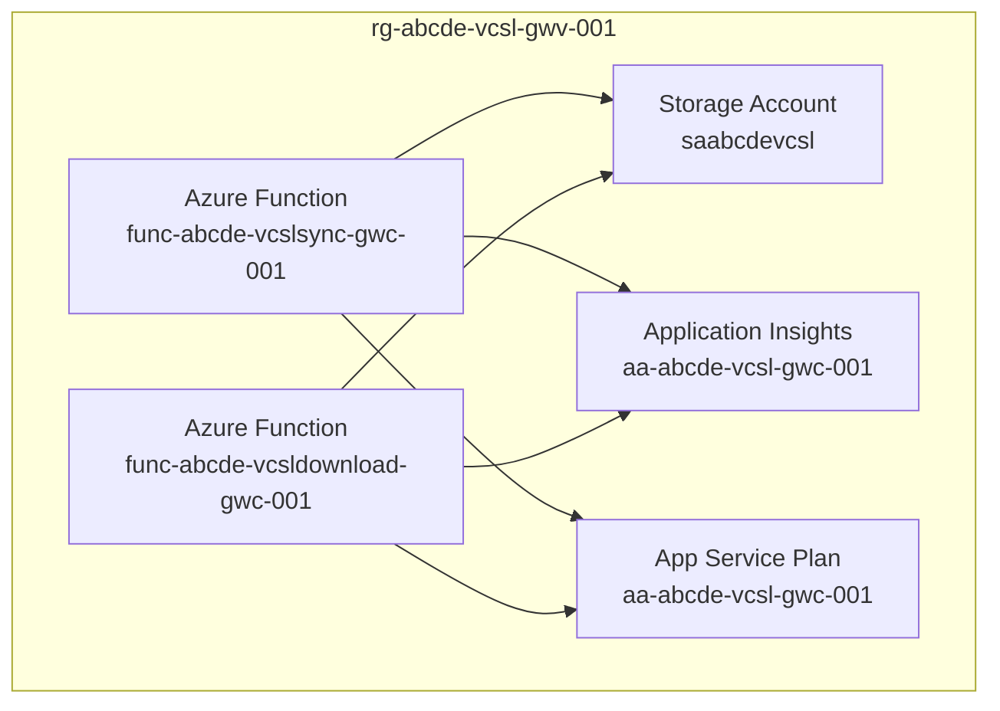

# VCSL
<style>
h4, h5, h6 {
    margin: 0;
}
</style>
## Aufbau
VCSL besteht aus 2 Azure Functions. 


## Voraussetzungen
### PowerShell Module
Für die Ausführung des Deployments müssen folgende PowerShell Module installiert sein:

#### Az.Identity
``` PowerShell
Install-Module Az.Identity -Scope CurrentUser
```

#### Az.Ressources
``` PowerShell
Install-Module Az.Ressources -Scope CurrentUser
```

#### Az.Websites
``` PowerShell
Install-Module Az.Websites -Scope CurrentUser
```

#### Az.Functions
``` PowerShell
Install-Module Az.Functions -Scope CurrentUser
```


### Bicep
Ebenso muss die Bicep CLI installiert sein.

Installation mit Winget
``` PowerShell
winget install -e --id Microsoft.Bicep
```

Installation mittels Powershell
``` PowerShell
# Create the install folder
$installPath = "$env:USERPROFILE\.bicep"
$installDir = New-Item -ItemType Directory -Path $installPath -Force
$installDir.Attributes += 'Hidden'

# Fetch the latest Bicep CLI binary
(New-Object Net.WebClient).DownloadFile("https://github.com/Azure/bicep/releases/latest/download/bicep-win-x64.exe", "$installPath\bicep.exe")

# Add bicep to your PATH
$currentPath = (Get-Item -path "HKCU:\Environment" ).GetValue('Path', '', 'DoNotExpandEnvironmentNames')

if (-not $currentPath.Contains("%USERPROFILE%\.bicep")) { 
    setx PATH ($currentPath + ";%USERPROFILE%\.bicep") 
}
if (-not $env:path.Contains($installPath)) { 
    $env:path += ";$installPath" 
}

# Verify you can now access the 'bicep' command.
bicep --help

# Done!
```

### .Net `(Nur beim selbst Kompilieren erforderlich)`
``` PowerShell
winget install Microsoft.DotNet.SDK.6
```

## Deployment
Folgende Parameter können bzw. müssen für das Deployment angegeben werden:

#### -TenantId `(erforderlich)`
Die ID des eigenen Tenants in welchem das Tool laufen soll. Die eigene Tenant ID kann [hier (Azure Active Directory | Overview)](https://portal.azure.com/#view/Microsoft_AAD_IAM/ActiveDirectoryMenuBlade/~/Overview) eingesehen werden.

#### -SubscriptionId `(erforderlich)`
Die ID der Subscription in welcher die Ressourcen liegen sollen. Die verfügbaren Subscriptions können [hier (Subscriptions)](https://portal.azure.com/#view/Microsoft_Azure_Billing/SubscriptionsBlade) eingesehen werden.

#### -GraphUserGroup `(erforderlich)`
Die ID der Gruppe in welchen alle Personen hinterlegt sind für welche die Daten der vCards vorgehalten werden sollen.

#### -OrgName `(erforderlich)`
Identifikator der eigenen Organisation. Dieser Wert wird in allen Ressourcennamen hinterlegt. Da die Namen einiger zu erstellender Ressourcen (Storage Account / Azure Functions) global eindeutig sein müssen sollte hier kein allzu allgemeiner Name verwendet werden. Empfehlenswert ist das Kürzel aus der Primary Domain

#### -ServicePrincipalName `(optional)`
Der Name des Service Principals (/App Registration) welche für die Graph Berechtigungen benutzt wird. Als Default ist `VCSL vCard` hinterlegt.

#### -HomepageUrl `(optional)`
Optionale Homepage welche in allen vCards hinterlegt wird.

#### -Location `(optional)`
Die Azure Region in welcher die Ressourcen erstellt werden sollen. Erlaubt sind:
- we (West Europe)
- ne (North Europe)
- gn (Germany North)
- gwc (Germany West Central) `default`

#### -UsePhoto `(optional)`
Wenn dieser Parameter mit angegeben wird werden die in Azure hinterlegten Bilder mit in die vCards eingefügt

#### -Recompile `(optional)`
Nur beim Deployment vom Source Code verfügbar. Wenn der Flag nicht gesetzt ist wird der Source Code nur bei der ersten Ausführung kompiliert.

<!-- ### Deployment vom Release

``` PowerShell
.\Run-Deployment.ps1 -TenantId "<TenantId>" -SubscriptionId "<SubscriptionId>" -GraphUserGroup "<GroupId (Aus Azure)>" -OrgName "<OrgName>" -HomepageUrl "<HomepageUrl>" -UsePhoto
``` -->

### Deployment vom Source Code
``` PowerShell
.\Run-DeploymentFromSource.ps1 -TenantId "<TenantId>" -SubscriptionId "<SubscriptionId>" -GraphUserGroup "<GroupId>" -OrgName "<OrgName>" -HomepageUrl "<HomepageUrl>" -UsePhoto -Recompile
```

## Berechtigungen vergeben
Um die Daten der Personen in der Organisation lesen zu können müssen nach dem Deployment noch Berechtigungen vergeben werden. Hierzu müss bei dem angelegten Service Principal [hier (Azure Active Directory | App registrations)](https://portal.azure.com/#view/Microsoft_AAD_IAM/ActiveDirectoryMenuBlade/~/RegisteredApps) die API permissions geöffnet werden. Dort muss die Microsoft Graph Berechtigung (Application) `Directory.Read.All` vergeben werden. Um die Berechtigung zu genehmigen sind `Global Administrator` Rechte erforderlich

## Bekannte Probleme
Beim Anlegen der Azure Functions kann es zu einer Race-Condition zwischen dem zu erstellenden Storage Account und den Functions selbst kommen. Hierbei kann es dazu kommen das das erstellen einer oder beider Functions fehlschlägt. In diesem Fall einfach das Deployment-Script erneut ausführen.

